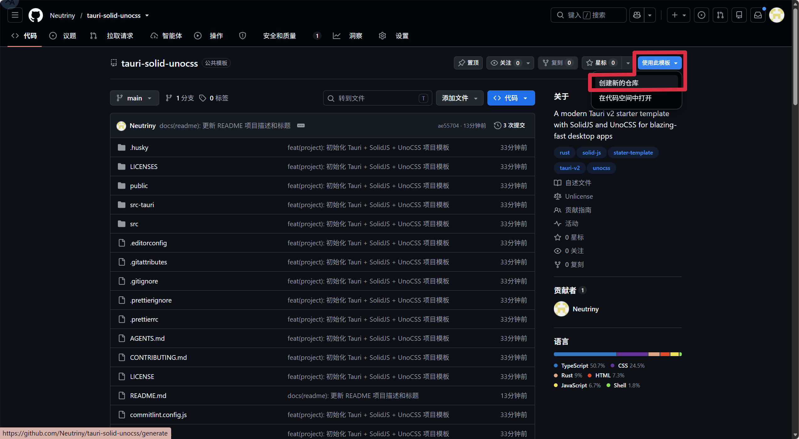

# Tauri + SolidJS + UnoCSS 项目模板

基于 Tauri v2 的桌面应用模板，使用 SolidJS 作为前端框架，UnoCSS 作为原子化 CSS 引擎，Vite 作为构建工具。

## 技术栈

[](https://tauri.app/)


## 环境要求

- **系统**：Windows (x86_64)
- **Node.js**：>= 22
- **Rust**：最新稳定版
- **包管理器**：pnpm

## 快速开始

使用此模板创建新仓库后克隆到本地并安装依赖：



```shell
git clone <your-repo-url>
cd <project-name>
pnpm install
```

启动开发模式：

```shell
pnpm tauri dev
```

构建生产版本：

```shell
pnpm tauri build
```

## 克隆后须知

使用本模板创建项目后，请修改以下文件：

| 文件                        | 修改内容                                                              |
|-----------------------------|-----------------------------------------------------------------------|
| `package.json`              | `name`（npm 包名）、`description`                                     |
| `src-tauri/Cargo.toml`      | `name`（crate 名）、`description`、`lib.name`                         |
| `src-tauri/tauri.conf.json` | `productName`（应用名）、`identifier`（反向域名标识符）、窗口 `title` |
| `README.md`                 | 本文件，替换为你的项目说明                                            |
| `LICENSE`                   | 如需更换协议，见下方 License 章节                                     |
| `src-tauri/icons/`          | 替换为你的应用图标（多分辨率）                                        |

## 常用命令

| 命令                | 说明                              |
|---------------------|-----------------------------------|
| `pnpm install`      | 安装前端依赖                      |
| `pnpm tauri dev`    | 启动 Vite 开发服务器 + Tauri 窗口 |
| `pnpm tauri build`  | 生产构建                          |
| `pnpm lint`         | ESLint 检查                       |
| `pnpm lint:fix`     | ESLint 自动修复                   |
| `pnpm format`       | Prettier 格式化                   |
| `pnpm format:check` | Prettier 检查                     |
| `pnpm check`        | ESLint + Prettier 同时检查        |

## 项目结构

```
src/
  index.tsx          # 前端入口（SolidJS render）
  App.tsx            # 根组件
  App.css            # 根组件样式
  assets/            # 静态资源
  vite-env.d.ts      # Vite 类型声明

src-tauri/
  src/
    main.rs          # 二进制入口
    lib.rs           # Tauri 应用构建与命令注册
  Cargo.toml         # Rust 依赖
  tauri.conf.json    # Tauri 配置
  icons/             # 应用图标
```

## 前后端通信

前端通过 `@tauri-apps/api/core` 的 `invoke("command_name", { args })` 调用 Rust 命令。
Rust 命令使用 `#[tauri::command]` 宏标注，在 `lib.rs` 中通过 `tauri::generate_handler!` 注册。

## 开发指引

详见 [AGENTS.md](./AGENTS.md) 了解代码风格、开发约定和提交规范。

## License

项目根目录的 `LICENSE` 为模板默认的 **Unlicense**（公有领域）。

如需更换协议，从 `LICENSES/` 目录中将选中的文件复制到根目录并重命名为 `LICENSE`，删除 `LICENSES/` 目录即可：

| 协议         | 文件                      | 类型            | 说明                         |
|--------------|---------------------------|-----------------|------------------------------|
| Unlicense    | `LICENSE`（根目录）       | 公有领域        | 模板默认，完全放弃版权       |
| MIT          | `LICENSES/LICENSE-MIT`    | 宽松            | 最流行，允许商业闭源         |
| Apache-2.0   | `LICENSES/LICENSE-APACHE` | 宽松            | 含专利授权，企业/云项目首选  |
| BSD-2-Clause | `LICENSES/LICENSE-BSD2`   | 宽松            | 极简，仅次于 MIT             |
| BSD-3-Clause | `LICENSES/LICENSE-BSD3`   | 宽松            | 比 BSD-2 多一条禁止背书      |
| BSL-1.0      | `LICENSES/LICENSE-BSL`    | 宽松            | Boost 专利授权，编译后可闭源 |
| LGPL-3.0     | `LICENSES/LICENSE-LGPL3`  | 弱 Copyleft     | 允许动态链接闭源，适合库     |
| MPL-2.0      | `LICENSES/LICENSE-MPL2`   | 文件级 Copyleft | 修改的文件需开源，其余可闭源 |
| EPL-2.0      | `LICENSES/LICENSE-EPL2`   | 弱 Copyleft     | Eclipse 系，可与 GPL 兼容    |
| GPL-3.0      | `LICENSES/LICENSE-GPL3`   | 强 Copyleft     | 衍生作品必须开源             |
| AGPL-3.0     | `LICENSES/LICENSE-AGPL3`  | 网络 Copyleft   | SaaS 也须开源                |
